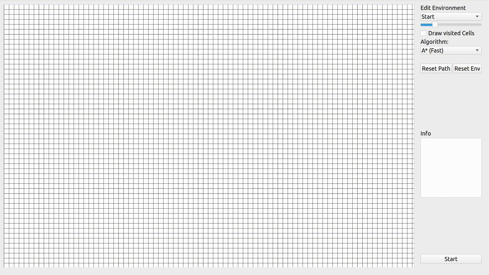
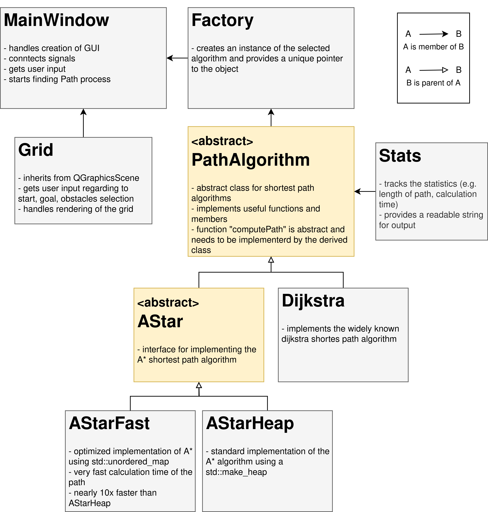

# FasterAStar: A GUI Application for Shortest Path Algorithms

FasterAStar presents a graphical user interface (GUI) application designed to explore shortest path algorithms, crafted using C++ and Qt. Significantly, the focus is on the implementation of the A* algorithm, distinguished by its remarkable computational speed in pathfinding.

## Architecture

The architecture is engineered to incorporate and test new path algorithms by deriving the abstract class _PathAlgorithm_. 
The key aspect to note is that the architecture adheres to the factory pattern, which offers high levels of generality and flexibility. 

    

    <em></em>

## class AStarFast {

The class AStarFast implements the A* algorithm without utilizing the commonly used heap data structure; instead, it employs the std::unordered_map data structure. Using an unordered_map requires mapping each cell in the grid to a unique identifier. Consequently, the grid is represented as a 1D array (std::vector), where the index position of the cell serves as its unique identifier. Each cell contains information regarding its 2D coordinates (x, y) and the distances g, h, and f. Here, g represents the distance to the start, h denotes the heuristic to the goal, and f is the sum of g and h.

### };

## Comparison AStarFast vs AStarHeap

||Num visited Cells|Length of Path|Time in s| 
|-|--|--|--|
|AStarHeap|120904|717|21.365|
|AStarFast|120602|717|0.39|

    <em>
    Table 1 displays the results averaged over 10 iterations for a challenging scenario. AStarHeap is implemented using a heap, while AStarFast utilizes an unordered_map.
    </em>

In Table 1, we note that AStarFast is significantly faster (almost 50 times) than AStarHeap, despite analyzing nearly the same number of cells. AStarHeap analyzed 300 additional cells, potentially due to its selection of the cell with the minimal f as the next candidate, as it employs different data structures.

AStarFast's remarkable speed is attributed to the design of the A* algorithm. In each iteration, A* identifies the cell with the minimum f value in the open list. It then proceeds to evaluate the four successors to determine their existence in the open list. This iterative process involves locating the cell with the minimum f value and checking it successors, resulting in one "find min f" operation and four "find successor" operations per iteration.

| |Find cell with min f|Find cell in data struct|
|-|:-:|:-:|
|AStarHeap|O(1)|O(n)|
|AStarFast|O(n)|O(1)|

    <em>
    Table 2: O-Notation of the different operations. Note that AStarHeap uses a heap and AStarFast uses an unordered_map.
    </em>

Let's calculate the time complexities for 1000 cells:
- AStarHeap(1000) = 1000 x O(1) + 4000 x O(n)
- AStarFast(1000) = 1000 x O(n) + 4000 x O(1)

We observe that AStarFast exhibits a lower time complexity for the larger operation. Consequently, AStarFast outperforms AStarHeap significantly in terms of speed.

### Build

Install Qt (Version 5):
`sudo apt-get install qt5-default`

Clone repository:
`git clone git@github.com:eazzyki/FasterAStar.git`

Navigate to project folder:
`cd FasterAStar`

Create MakeFile using qmake:
`qmake FasterAStar.pro`

Build executable:
`make`

Run application:
`./bin/FasterAStar`